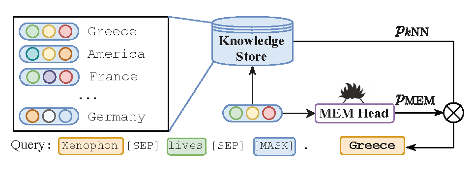

# KNN-KG
Code for the NLPCC2023 paper "[Reasoning Through Memorization: Nearest Neighbor Knowledge Graph Embeddings with Language Models](https://arxiv.org/abs/2201.05575)".

<div align=center></div>

Requirements
==========
To install requirements:

```
pip install -r requirements.txt
```


Run the experiments
==========

## Training

### Entity Embedding Initialization

Use the command below to add entities to BERT and train the entity embedding layer to use in the later training. For another dataset `WN18RR` just replacing the dataset name will be fine.

```shell
./scripts/pretrain_fb15k.sh
```

The parameters of Entity Embedding Layer trained will be used in the next `Entity prediction task`.

 ### Entity Prediction Task

Use the command below to train the model to predict the correct entity in the masked position.

```shell
./scripts/fb15k-237/fb15k.sh
```

## Consturct Knowledge Store

After training the model in `Entity prediction task`, we use the model to get the knowledge store built from triples and descriptions.

```shell
./scripts/fb15k-237/get_knowledge_store.sh
```

## Inference

Here we have a trained model and our knowledge store (e.g., faiss.dump file), use the command below to inference in the test set.

```shell
./scripts/fb15k-237/inference.sh
```

And for inductive setting, the command is similar to the transductive setting (just replace the `dataset` with inductive dataset), the code will automatically handle the differences.

